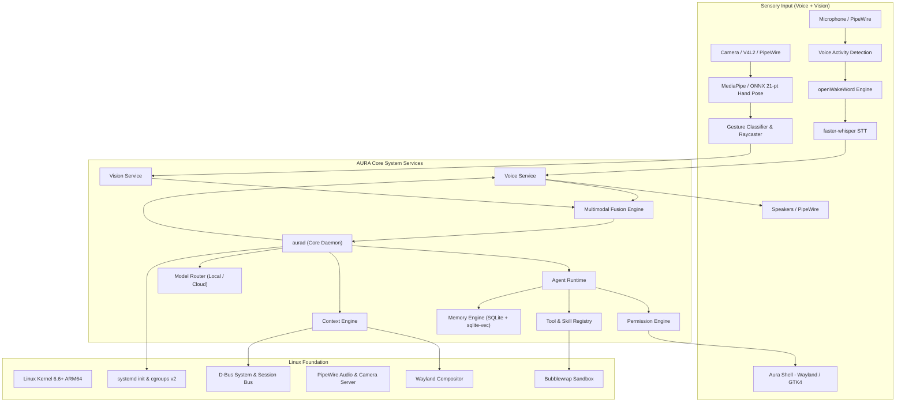

# AURA OS
> **Autonomous Unified Runtime Architecture**
> A voice-first and gesture-enabled, AI-native operating environment built on top of Linux.

[](file:///Users/aryansingh/Documents/Aura-OS/context/PROGRESS-TRACKER.md)
[-blue.svg)](file:///Users/aryansingh/Documents/Aura-OS/context/PLAN.md)
[](LICENSE)
[](file:///Users/aryansingh/Documents/Aura-OS/context/ARCHITECTURE.md)

---

## 1. Vision & Core Paradigm

**AURA OS** is an ambient computing environment inspired by systems like JARVIS—where users interact primarily through natural speech and spatial hand gestures via standard cameras, while autonomous AI agents execute tasks as first-class system primitives. Instead of requiring human operators to manually click menus, arrange window hierarchies, and coordinate disparate terminal commands, AURA elevates user voice and gesture intent into direct, autonomous system execution.

### The Paradigm Shift

```
Traditional Operating System:
Human ───► Mouse & Keyboard ───► Applications ───► Actions ───► Manual Verification

AURA OS (Jarvis-Like Multimodal):
Human (Voice + Spatial Gestures) ───► Goal ───► Agents ───► Skills & Tools ───► Actions ───► Autonomous Verification
```

In AURA, you do not launch an IDE, navigate to a directory, run a build command, search through terminal backscroll for errors, and manually edit source files. Instead, you point at a failing terminal window and say:
> *"Aura, fix that error."*

AURA fuses your pointing gesture with the voice command, identifies the target window, analyzes compiler and test output, plans a dependency graph of discrete tasks, requests permissions for sensitive actions, spawns specialized agents into sandboxed execution environments, verifies the resolution against test output, updates its episodic memory, and speaks the verified outcome back to you.

---

## 2. What AURA Is (and What It Is Not)

| What AURA IS NOT | What AURA IS |
| :--- | :--- |
| ❌ A browser-based web application or Electron wrapper | ✅ A bootable Linux-based operating environment running natively |
| ❌ A simple ChatGPT or LLM API wrapper | ✅ A multi-process agentic OS runtime with local memory, IPC, and daemons |
| ❌ Merely a desktop voice assistant (e.g. Siri, Alexa) | ✅ An autonomous task-planning, tool-executing, and error-recovering operating runtime |
| ❌ A scratch Linux kernel or custom kernel fork | ✅ An innovation layer built cleanly on standard Linux, systemd, Wayland, and PipeWire |
| ❌ Cloud-dependent spyware or opaque black box | ✅ A local-first, privacy-focused, observable, and strictly sandboxed system |

---

## 3. Core Architectural Philosophy

AURA OS adheres strictly to 18 core architectural principles:

1. **Linux Foundations**: Linux handles hardware, device drivers, kernel scheduling, and memory management. AURA innovates above the kernel.
2. **First-Class AI Agents**: Autonomous agents are treated as intelligent processes with explicit IDs, budgets, contexts, parent-child hierarchies, and sandboxes.
3. **Voice-First & Gesture-Powered Multimodal Interaction**: Natural speech combined with 3D spatial hand gestures (pointing, waving, pinching) forms the primary interface; displays, keyboards, and mice serve as high-bandwidth fallback.
4. **Mandatory Observability**: Every autonomous agent action, plan deviation, and tool execution is transparently logged, visualized, and traceable.
5. **Human-in-the-Loop Permission Gates**: Consequential, destructive, or external operations require explicit human authorization. Voice alone cannot authorize sensitive operations.
6. **Active Verification**: Agents never assume actions succeeded; they run critics, inspect exit codes, parse diffs, and verify assertions before declaring completion.
7. **Pragmatic Evolutionary Design**: Avoid premature microservices, Kubernetes, or distributed message queues. Build solid, single-node Unix foundations first.
8. **Vertical Slices Over Infrastructure**: Implement end-to-end user journeys before building speculative abstractions.
9. **Modular Contracts**: Decouple daemons and engines behind well-defined IPC interfaces (Unix Domain Sockets & D-Bus) so subsystems can be independently replaced.
10. **Local-First Autonomy**: Core voice processing, vision tracking, memory retrieval, and basic reasoning must be capable of running offline on local silicon.
11. **Pluggable Cloud Models**: Complex planning and high-parameter reasoning route dynamically to cloud providers without locking into any single vendor.
12. **Dynamic Model Routing**: Intelligently route tasks based on cost, latency, context window requirements, and reasoning benchmarks.
13. **Privacy and Security by Construction**: Local context buffers, ephemeral memory, and encrypted episodic stores prevent unauthorized telemetry.
14. **Vision Privacy by Design**: Camera frames are processed strictly in-memory within volatile ring buffers for 21-point hand landmark estimation and immediately discarded; raw video is never stored or transmitted.
15. **Ambient, Minimalist Native UI**: The desktop shell is an ambient visual feedback canvas (Wayland/GTK4), not a cluttered legacy desktop with persistent chatbot widgets.
16. **Honest Capabilities**: AURA treats LLMs as probabilistic reasoning engines requiring external sandboxes and deterministic tooling, not as artificial general intelligence (AGI).
17. **Subsystem Resilience**: Isolated daemon crashes must not panic the underlying Linux OS or compromise active user sessions.
18. **Hardware Portability**: Developed natively for ARM64 (Apple Silicon virtualization via UTM) while preserving strict architectural paths for eventual x86_64 deployment.

---

## 4. Key Capabilities & Authentic Interactions

### "Aura, fix that error." (Spatial Pointing + Voice)
- **Multimodal Fusion**: Camera tracks index finger raycasting to the active terminal window; speech parser resolves demonstrative pronoun (*"that error"*).
- **Inspection & Planning**: Captures terminal scrollback, parses compiler stack trace, and spawns a `CodingAgent` in a Bubblewrap sandbox.
- **Execution & Verification**: Applies patch, re-runs tests, verifies exit code 0.
- **Speech Synthesis**: Speaks: *"Resolved the IndexError in auth_service.py by adding bounds validation."*

### Open Palm Gesture (Instant Pause)
- **Hand Gesture Recognition**: Raising an open palm toward the camera triggers an immediate `GESTURE_PAUSE` event.
- **Action**: Instantly halts active TTS speech and pauses running agent tool steps without touching a keyboard or mouse.

### In-Air Tap / Push (Spatial Permission Approval)
- **Interactive Gate**: When an agent requests file modification, a permission modal (`UI-007`) displays a visual diff.
- **Action**: An in-air forward push gesture ("spatial tap") authorizes the action, satisfying the physical interaction requirement.

### "Aura, open my project and run the tests."
- **Context Resolution**: Identifies the currently focused repository or queries semantic memory for the most recently edited codebase.
- **Planning**: Launches a `CodingAgent` inside a Bubblewrap container with access limited to the project directory.
- **Execution & Verification**: Executes the test suite via `terminal.execute`, observes exit codes, parses stack traces, and prepares an execution report.
- **Speech Synthesis**: Speaks a concise summary: *"Tests completed. 42 passed, 2 failed in auth_service.py. Shall I inspect the failures?"*

### "Aura, find the networking PDF that explains congestion control."
- **Semantic File Retrieval**: Uses `sqlite-vec` embeddings across document chunks rather than crude filename matching.
- **Inspection**: Extracts the document metadata and relevant page indices.
- **Action**: Opens the document in the default document viewer directly to the section discussing BBR/Cubic congestion control algorithms.

### "Aura, organize my Downloads folder."
- **Inspection**: Scans file extensions, MIME types, and content summaries.
- **Plan Generation**: Proposes a directory classification schema (`/Documents`, `/Installers`, `/Media`, `/Archives`).
- **Permission Gate**: Displays a visual diff/confirmation overlay (`UI-007`) asking: *"Allow moving 34 files in ~/Downloads?"*
- **Execution & Undo Log**: Moves files while recording transaction logs for seamless rollback.

### "Aura, what's using so much memory?"
- **System Inspection**: Inspects kernel cgroups, systemd slices, and process memory maps via `system.inspect`.
- **Reasoning**: Correlates high RSS usage with recent background tasks or runaway browser processes.
- **Speech Response**: *"A Chromium background worker is consuming 3.2 GB of RAM. Would you like me to terminate it?"*

---

## 5. System Architecture Overview



For the complete technical blueprint, IPC protocol schemas, and data models, consult the authoritative [ARCHITECTURE.md](file:///Users/aryansingh/Documents/Aura-OS/context/ARCHITECTURE.md).

---

## 6. Technology Stack

| Domain | V0 Technology Selection | Rationale |
| :--- | :--- | :--- |
| **Host OS** | Debian 12 / Ubuntu 24.04 LTS (ARM64 Minimal) | Stable Linux foundation, first-class systemd, broad driver support |
| **Virtualization** | UTM / Apple Hypervisor Framework on Apple Silicon | High-performance near-native ARM64 execution, hardware audio passthrough |
| **Core Daemons** | Python 3.12+ (`asyncio`, `pydantic`, `anyio`) | Rapid iteration for agent loops, dynamic tool orchestration, async IPC |
| **Audio Routing** | PipeWire & WirePlumber | Ultra-low latency, modular audio node graph, seamless barge-in support |
| **Wake Word** | openWakeWord / Porcupine | Efficient local wake-word detection with low CPU footprint |
| **Speech-to-Text** | `faster-whisper` (CTranslate2 INT8) | State-of-the-art local transcription optimized for ARM64 NEON |
| **Text-to-Speech** | Piper TTS / Kokoro | High-quality, low-latency neural TTS running locally on CPU/GPU |
| **Camera & Vision** | PipeWire Camera Portal / V4L2 | Native Linux camera capture, secure device permission gating |
| **Hand Tracking** | MediaPipe Hands / Quantized ONNX | 21 3D hand keypoints, real-time 30-60 FPS, <8% ARM64 CPU overhead |
| **Desktop Shell** | Rust (GTK4 / Layer-Shell / Wayland) | Native memory safety, modern GPU-rendered glassmorphism, low latency |
| **IPC** | Unix Domain Sockets (streaming) + D-Bus (control) | Industry standard Linux desktop integration, native systemd support |
| **Storage & Vectors** | SQLite 3 + `sqlite-vec` extension (WAL mode) | Zero external database processes, fast local semantic vector search |
| **Sandboxing** | Bubblewrap (`bwrap`) + Linux Namespaces | Unprivileged containerization, fine-grained filesystem and network isolation |
| **Model Routing** | LiteLLM / Custom router (Ollama/llama.cpp + Cloud) | Clean failover between local edge models and cloud frontier LLMs |

---

## 7. Repository Layout

```
Aura-OS/
├── README.md               # Public entry point & high-level architecture
│
├── context/                # Authoritative system documentation & state
│   ├── ARCHITECTURE.md     # Authoritative deep-dive system architecture specification
│   ├── PLAN.md             # 12-phase implementation roadmap & milestone definitions
│   ├── PROGRESS-TRACKER.md # Persistent project dashboard, task registry, and live state
│   └── UI-REGISTRY.md      # Canonical registry of UI components, screens, and gesture states
│
├── aura/                   # Core Python runtime & system services
│   ├── core/               # aurad daemon, service lifecycle, config loader
│   ├── agents/             # BaseAgent, AgentManager, Scheduler, TaskGraph
│   ├── voice/              # Audio pipeline, VAD, wake-word, STT, TTS, barge-in
│   ├── vision/             # Camera capture, 21-pt hand tracker, gesture classifier, raycaster
│   ├── fusion/             # Multimodal fusion engine (voice + spatial gesture alignment)
│   ├── context/            # Window watcher, clipboard, terminal buffer, active project
│   ├── memory/             # Working, episodic (SQLite), semantic (sqlite-vec)
│   ├── models/             # ModelRouter, local/cloud adapters, token budgets
│   ├── permissions/        # Policy engine, capability tokens, elevation flows
│   ├── tools/              # Core tool implementations (fs, terminal, sys, app)
│   ├── skills/             # Skill registry, discovery, manifests, MCP adapter
│   ├── verification/       # Execution verifiers, critic engines, state diffs
│   └── ipc/                # D-Bus interfaces and Unix Domain Socket servers
│
├── desktop/                # Native ambient desktop shell (Wayland / GTK4)
│   ├── shell/              # Rust Wayland layer-shell compositor client
│   ├── components/         # UI-001 Orb, UI-002 Overlay, UI-004 Monitor, UI-021 Reticle
│   └── assets/             # Icons, shaders, sound effects, themes
│
├── services/               # System service definitions
│   └── systemd/            # systemd user units (aura-core.service, etc.)
│
├── packaging/              # Distribution and deployment assets
│   ├── arm64/              # UTM VM configurations, kickstart/cloud-init files
│   └── iso/                # Live ISO build scripts and Plymouth boot themes
│
├── tests/                  # Automated verification suite
│   ├── unit/               # Subsystem unit tests
│   ├── integration/        # Inter-service IPC & permission tests
│   └── system/             # End-to-end VM automated scenarios
│
├── scripts/                # Development, provisioning, and build scripts
├── docs/                   # Supporting architectural decision records (ADRs)
├── pyproject.toml          # Python project dependencies & metadata
└── Makefile                # Unified build and VM management targets
```

---

## 8. Getting Started: UTM Virtual Machine Setup

Initial development of AURA OS takes place within an ARM64 Linux virtual machine running on Apple Silicon via UTM.

### Prerequisites
- Apple Silicon Mac (M1/M2/M3/M4) running macOS Sonoma 14+ or Sequoia 15+.
- [UTM Virtual Machines](https://mac.getutm.app/) installed (`brew install --cask utm`).
- Ubuntu Server 24.04 LTS (ARM64) or Debian 12 Bookworm (ARM64) minimal ISO.
- Python 3.12+ and Rust toolchain (`rustup`) installed on host/guest.

### Step-by-Step VM Provisioning

1. **Create Virtual Machine in UTM**:
   - Mode: **Virtualize** (do NOT use Emulation).
   - Operating System: **Linux**.
   - Hardware: Allocate 4+ CPU cores, 8 GB RAM, and 32 GB NVMe storage.
   - Display: VirtIO GPU with 3D acceleration enabled.
   - Sound: Intel HD Audio / VirtIO Sound (ensure host microphone passthrough is active).
   - Network: Shared Network (Bridged mode optional for direct SSH).

2. **Clone & Bootstrap the Repository**:
   ```bash
   git clone https://github.com/Aryan-en/Aura-OS.git
   cd Aura-OS
   make bootstrap-dev
   ```

3. **Verify Audio Passthrough & Microphone Capture**:
   ```bash
   # Test microphone capture
   arecord -D pipewire -f cd -d 3 test.wav && aplay test.wav
   ```

4. **Launch the Core Daemon in Development Mode**:
   ```bash
   python -m aura.core.main --dev --log-level=DEBUG
   ```

---

## 9. Roadmap Summary

The engineering plan is structured into 11 distinct phases:

- **PHASE 0 — Foundation**: Repository structure, ARM64 UTM environment, systemd units, logging, IPC skeleton.
- **PHASE 1 — Voice MVP**: Vertical slice ("Aura, create a folder called Test on my Desktop") with wake-word, VAD, STT, safe fs tool, verification, and TTS.
- **PHASE 2 — Agent Runtime**: State machines, Task DAGs, Planner, Tool Registry, execution retries.
- **PHASE 3 — Memory Engine**: Working memory, episodic history in SQLite, semantic embeddings via `sqlite-vec`.
- **PHASE 4 — Context Engine**: Wayland window tracking, active application inspection, clipboard and terminal integration.
- **PHASE 5 — Multi-Agent Runtime**: Dynamic agent spawning, parent/child supervision, parallel execution, verifiers.
- **PHASE 6 — Native Desktop**: Ambient Wayland shell in Rust/GTK4, Aura Orb (`UI-001`), Overlays, Permission Modals.
- **PHASE 7 — Advanced OS Integration**: D-Bus system bus integration, notification daemon, semantic filesystem indexing.
- **PHASE 8 — Security & Sandboxing**: Bubblewrap isolation, capability tokens, immutable audit trail, root prevention.
- **PHASE 9 — Local AI Autonomy**: 100% offline stack with local STT, TTS, and quantized LLMs running via GGUF/llama.cpp.
- **PHASE 10 — Distribution & Packaging**: Bootable ARM64 ISO, live installer, Plymouth boot splash, pre-built VM images.

For full phase deliverables, acceptance tests, and risk mitigations, consult [PLAN.md](file:///Users/aryansingh/Documents/Aura-OS/context/PLAN.md).

---

## 10. Security & Permission Philosophy

AURA operates on a strict **Zero-Implicit-Trust** model for autonomous agents:
- **Least Privilege Execution**: Agents execute in non-root user contexts with ephemeral sandboxes created via Bubblewrap. Filesystem access outside project boundaries is blocked by default.
- **Explicit Permission Policies**:
  - `ALLOW`: Non-destructive read operations (e.g. read current time, get system load).
  - `ASK_ONCE`: Elevated operations permitted for the duration of a single task run.
  - `ASK_ALWAYS`: Consequential actions (file deletion, network sockets, root elevation) require interactive confirmation.
  - `DENY`: Hard-blocked actions (unrestricted raw disk writes, credential theft).
- **The Voice Elevation Barrier**: Voice commands alone **cannot** authorize destructive operations. If an agent requests `filesystem.delete` or `terminal.root`, AURA demands explicit interactive confirmation via the native desktop modal (`UI-007`) or a physical keyboard challenge.
- **Tamper-Evident Audit Logging**: Every planned action, tool invocation, parameter set, and verification output is written to an append-only SQLite log before execution begins.

---

## 11. AI Coding Agent Rules

All human contributors and AI coding agents working on AURA OS **must** abide by these rules:

1. **Read Before Writing**: Always read [README.md](file:///Users/aryansingh/Documents/Aura-OS/README.md), [ARCHITECTURE.md](file:///Users/aryansingh/Documents/Aura-OS/context/ARCHITECTURE.md), [PLAN.md](file:///Users/aryansingh/Documents/Aura-OS/context/PLAN.md), [PROGRESS-TRACKER.md](file:///Users/aryansingh/Documents/Aura-OS/context/PROGRESS-TRACKER.md), and [UI-REGISTRY.md](file:///Users/aryansingh/Documents/Aura-OS/context/UI-REGISTRY.md) before making architectural modifications.
2. **Synchronize Project State**: Whenever you complete a task or change code, update [PROGRESS-TRACKER.md](file:///Users/aryansingh/Documents/Aura-OS/context/PROGRESS-TRACKER.md) immediately.
3. **Keep V0 Simple**: Prioritize working vertical slices over massive, speculative infrastructure.
4. **Never Bypass Permissions**: Never hardcode bypasses around `PermissionEngine` or grant agents unrestricted root access.
5. **Preserve Observability**: Ensure all agent actions produce structured events that can be inspected by developers and end users.

---

## 12. Project Status & Experimental Notice

> [!WARNING]
> **AURA OS is currently in active pre-alpha development (Phase 0 / Milestone M0).**
> It is not yet intended as a daily driver operating system. Do not run unverified agent builds on bare-metal systems containing unbacked-up sensitive personal data. Always develop inside the recommended UTM virtualized container.

---

## 13. Documentation Index

- **[ARCHITECTURE.md](file:///Users/aryansingh/Documents/Aura-OS/context/ARCHITECTURE.md)**: Deep technical architecture specification, subsystem designs, data schemas, IPC protocols, and diagrams.
- **[PLAN.md](file:///Users/aryansingh/Documents/Aura-OS/context/PLAN.md)**: Detailed engineering phase plan, definition of done, automated test suites, and risk register.
- **[PROGRESS-TRACKER.md](file:///Users/aryansingh/Documents/Aura-OS/context/PROGRESS-TRACKER.md)**: Live task tracker, component status matrix, known bugs, and developer session notes.
- **[UI-REGISTRY.md](file:///Users/aryansingh/Documents/Aura-OS/context/UI-REGISTRY.md)**: Canonical registry of all UI components, Wayland screens, visual design tokens, and voice state machines.