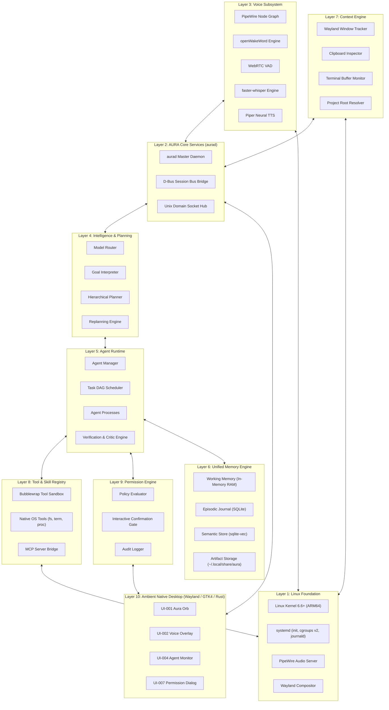
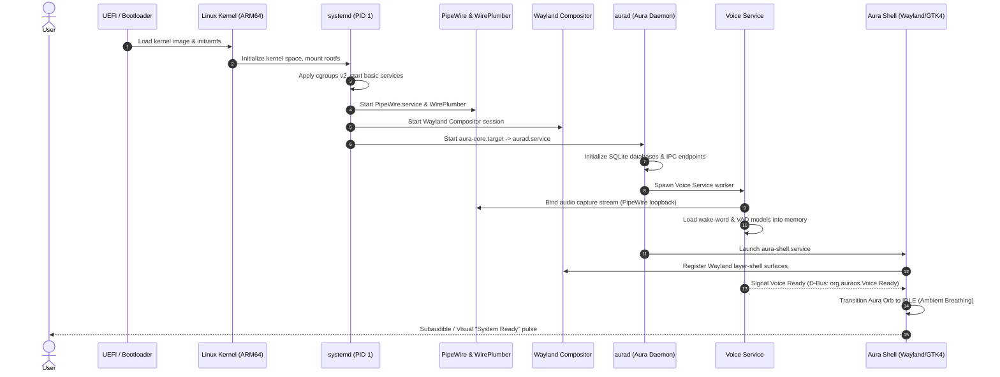
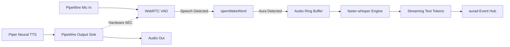
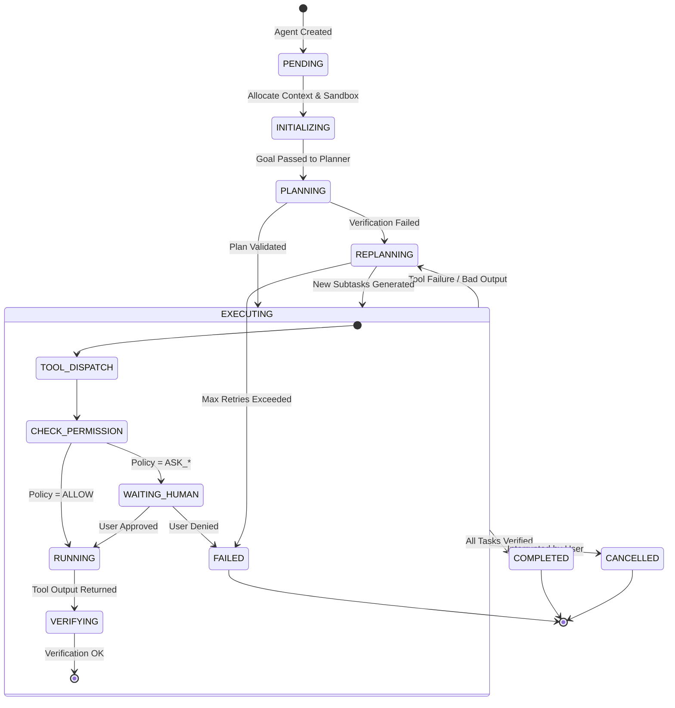
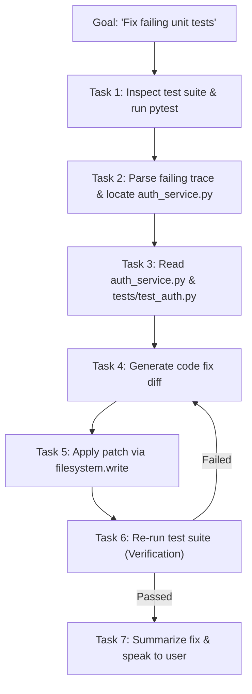
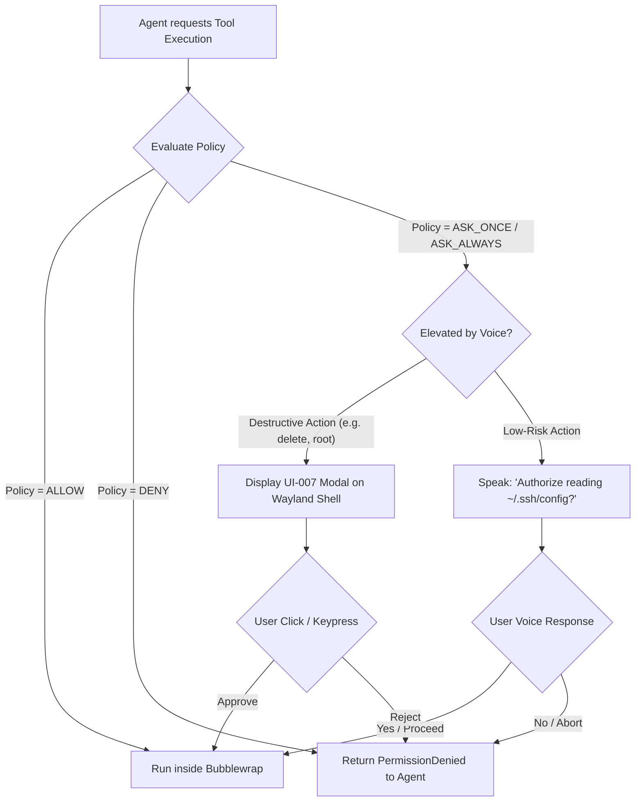
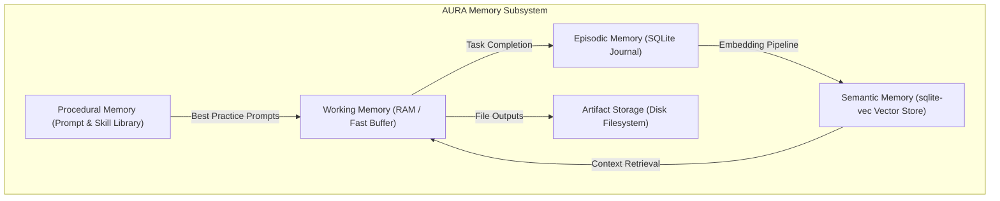
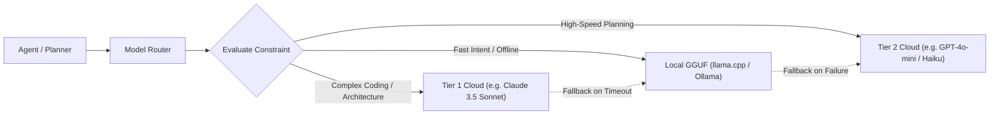

# AURA OS — Technical Architecture Specification
> **Autonomous Unified Runtime Architecture**
> Version: 0.1.0-draft | Status: Approved Baseline | Target: ARM64 Linux

---

## Table of Contents
1. [Architecture Goals & Non-Goals](#1-architecture-goals--non-goals)
2. [Design Principles](#2-design-principles)
3. [System Overview & Layered Architecture](#3-system-overview--layered-architecture)
4. [System Boot Sequence](#4-system-boot-sequence)
5. [Core Daemon: `aurad`](#5-core-daemon-aurad)
6. [Voice Subsystem](#6-voice-subsystem)
7. [Context Engine](#7-context-engine)
8. [Agent Runtime & Process Model](#8-agent-runtime--process-model)
9. [Task Model & DAG Scheduler](#9-task-model--dag-scheduler)
10. [Planner & Replanning Engine](#10-planner--replanning-engine)
11. [Supervisor & Agent Factory](#11-supervisor--agent-factory)
12. [Tool & Skill Registry (and MCP Integration)](#12-tool--skill-registry-and-mcp-integration)
13. [Permission Engine](#13-permission-engine)
14. [Memory Architecture (Working, Episodic, Semantic, Procedural)](#14-memory-architecture)
15. [Model Router & LLM Gateway](#15-model-router--llm-gateway)
16. [Verification & Critic System](#16-verification--critic-system)
17. [Native Desktop Shell Architecture](#17-native-desktop-shell-architecture)
18. [IPC & D-Bus Specifications](#18-ipc--d-bus-specifications)
19. [Storage Layout & Data Schemas](#19-storage-layout--data-schemas)
20. [Observability, Logging & Tracing](#20-observability-logging--tracing)
21. [Sandboxing & Process Isolation](#21-sandboxing--process-isolation)
22. [Threat Model & Security Hardening](#22-threat-model--security-hardening)
23. [Failure Recovery & Resiliency](#23-failure-recovery--resiliency)
24. [Offline vs Cloud Operation](#24-offline-vs-cloud-operation)
25. [Networking & Egress Controls](#25-networking--egress-controls)
26. [Update Architecture](#26-update-architecture)
27. [ARM64 & x86_64 Hardware Considerations](#27-arm64--x86_64-hardware-considerations)
28. [V0 Implementation vs Long-Term Architecture](#28-v0-implementation-vs-long-term-architecture)
29. [Formal Entity Specifications](#29-formal-entity-specifications)

---

## 1. Architecture Goals & Non-Goals

### 1.1 Architecture Goals
1. **Voice-First Native Environment**: Make natural human speech the primary system command input, achieving end-to-end latency below 800ms for local intent resolution.
2. **First-Class Agent Abstraction**: Model autonomous agents as standard operating system entities with lifecycle management, resource boundaries, process IDs, and memory isolation.
3. **Deterministic OS Control**: Provide agents with verified, structured tools to manipulate files, run processes, query state, and manage windows rather than relying on unreliable mouse/keyboard coordinate hallucination.
4. **Active Verification & Self-Healing**: Enforce closed-loop execution where every tool action is verified against ground truth (compiler errors, exit codes, file hashes) with automated replanning on failure.
5. **Zero-Implicit-Trust Sandboxing**: Execute all AI-generated code and tool commands in isolated Linux namespaces via Bubblewrap with granular capability-based permissions.
6. **Local-First Privacy**: Ensure all voice processing (VAD, wake word, STT, TTS) and core episodic memory retrieval function completely offline on local hardware.

### 1.2 Non-Goals
1. **Not a Scratch Kernel**: AURA does not reinvent device drivers, memory pagers, or the Linux scheduler. It builds strictly upon standard Linux kernels.
2. **Not a Browser or Electron App**: AURA is a native Linux system environment, not a WebApp pinned to a desktop.
3. **Not a Monolithic LLM Wrapper**: AURA is not a single prompt piped to an API endpoint; it is a distributed set of modular Unix daemons communicating over IPC.
4. **Not Premature Cloud-Native Infrastructure**: AURA does not run Kubernetes, Kafka, or distributed multi-node clusters in V0. It is a lean single-host OS.
5. **Not Uncontrolled AGI**: AURA treats modern models as probabilistic pattern engines that must be constrained by deterministic validation and explicit human approval.

---

## 2. Design Principles

- **Separation of Mechanism and Policy**: Low-level tools perform operations (mechanism); higher-level planners and permission engines decide whether and how they run (policy).
- **Graceful Degradation**: If network access drops, AURA falls back to local models and offline tools without system panic.
- **Fail-Safe Defaults**: Permissions default to `DENY`. File modifications outside the sandbox default to `BLOCKED`.
- **Transparent Auditability**: Every prompt sent, tool invoked, and byte written is recorded in an immutable local journal.
- **Ambient Presence**: The user interface does not demand persistent visual attention; it emerges when triggered and recedes into ambient tranquility when idle.

---

## 3. System Overview & Layered Architecture

AURA OS is structured into ten distinct architectural layers:



---

## 4. System Boot Sequence

The transition from firmware to an active, voice-ready AURA session follows a deterministic initialization sequence:



1. **UEFI / Bootloader**: Bootstraps the ARM64 kernel with hardware device trees.
2. **Linux Kernel**: Initializes CPU clusters, memory controllers, VirtIO subsystems (under UTM), and security modules.
3. **systemd (PID 1)**: Brings up system slices, mounts virtual filesystems, and transitions to the graphical target.
4. **PipeWire & WirePlumber**: Establishes the real-time audio routing graph, configuring ALSA/VirtIO sound devices with zero-latency buffers.
5. **`aurad`**: Launches the core orchestration daemon under the user session slice (`app.slice/aura-core.service`). Initializes local databases, validates configuration files, and exposes D-Bus endpoints.
6. **Voice Service**: Loads lightweight openWakeWord and VAD models into RAM; attaches to the PipeWire input stream.
7. **`aura-shell`**: Launches the native Wayland desktop interface, binding the ambient Voice Orb (`UI-001`) to the layer-shell overlay.

---

## 5. Core Daemon: `aurad`

`aurad` is the central nervous system of AURA OS. It does not perform LLM inference or audio processing directly; instead, it coordinates lifecycle, IPC routing, and state synchronization across dedicated worker subsystems.

```
                    ┌─────────────────────────┐
                    │      aurad Daemon       │
                    │   (PID, Event Loop)     │
                    └────────────┬────────────┘
         ┌──────────────────────┼──────────────────────┐
         ▼                      ▼                      ▼
┌────────────────┐     ┌────────────────┐     ┌────────────────┐
│   IPC Router   │     │ State Machine  │     │ Service Watch  │
│  (UDS / D-Bus) │     │  & Event Hub   │     │  (Subprocess)  │
└────────────────┘     └────────────────┘     └────────────────┘
```

### 5.1 Daemon Responsibilities
- **Subsystem Lifecycle**: Monitors and supervises child services (`aura-voice`, `aura-context`, `aura-agents`).
- **IPC Dispatch**: Hosts Unix Domain Sockets for streaming data and registers the primary D-Bus session interface (`org.auraos.Core`).
- **Configuration Authority**: Parses and serves system configurations from `/etc/aura/config.toml` and `~/.config/aura/config.toml`.
- **System Event Bus**: Dispatches broadcast events (e.g. `AGENT_STATE_CHANGED`, `VOICE_STATE_CHANGED`, `PERMISSION_REQUESTED`).

---

## 6. Voice Subsystem

The Voice Subsystem provides continuous, low-latency, hands-free interaction. It is architected for zero cloud leakage of ambient audio and supports real-time barge-in (interruption).



### 6.1 Subsystem Components
1. **Audio Capture**: Binds to PipeWire via an asynchronous C/Rust wrapper. Samples are captured at 16kHz, 16-bit mono PCM.
2. **Voice Activity Detection (VAD)**: Runs continuous WebRTC VAD in 30ms frames. Non-speech audio is immediately discarded.
3. **Wake-Word Detection**: Runs `openWakeWord` against a custom-trained model for the activation phrase *"Aura"*. Operates with <1% single-core CPU overhead on ARM64.
4. **Streaming Speech-to-Text (STT)**: Employs `faster-whisper` (CTranslate2) utilizing 8-bit quantized models (`small.en` or `base.en`). Audio preceding the wake word by 200ms is preserved in a circular ring buffer to prevent clipping the first syllable.
5. **Text-to-Speech (TTS)**: Employs `Piper TTS` for instant, natural speech generation. Audio chunks stream directly into PipeWire buffers, enabling sub-200ms time-to-first-audio.
6. **Barge-in / Interruption Support**: When TTS is actively speaking and the user speaks, VAD triggers an immediate `AUDIO_INTERRUPT` event over D-Bus, instantly zeroing PipeWire output buffers and transitioning state back to `LISTENING`.

---

## 7. Context Engine

The Context Engine continuously aggregates OS telemetry to provide grounding for natural language commands like:
> *"Aura, fix this."*
> *"Aura, send this code to Sarah."*

```
                              ┌──────────────────────────┐
                              │      Context Engine      │
                              └────────────┬─────────────┘
          ┌─────────────────┬──────────────┴─────────────┬─────────────────┐
          ▼                 ▼                            ▼                 ▼
┌──────────────────┐┌──────────────────┐ ┌──────────────────┐┌──────────────────┐
│ Window Tracker   ││ Clipboard Watch  │ │ Terminal Monitor ││ Project Resolver │
│ (Wayland Toplevel)││ (wl-clipboard)   │ │ (pty hook / OSC7)││ (git root / cwd) │
└──────────────────┘└──────────────────┘ └──────────────────┘└──────────────────┘
```

### 7.1 Tracked Context Primitives
- **Active Window & Application**: Queries Wayland via the `wlr-foreign-toplevel-management-unstable-v1` protocol or GNOME Shell Mutter D-Bus interface.
- **Selection & Clipboard**: Watches Wayland primary selection and system clipboard buffers with token truncation (retaining up to 4096 tokens).
- **Terminal Context**: Integrates with terminal emulators via shell integration scripts (sending OSC 7 directory updates and OSC 133 command status codes).
- **Active Workspace / Project**: Traverses up from current working directory to identify `.git`, `pyproject.toml`, `Cargo.toml`, or `package.json`.

### 7.2 "Fix This" Resolution Logic
When a command contains ambiguous demonstrative pronouns ("this", "that", "the error"):
1. Check active terminal emulator last command exit code; if non-zero, capture stdout/stderr from the last execution block.
2. If the active application is an editor, capture the active file path, cursor line number, and active selection.
3. If text is highlighted in the active window, capture the selection buffer.
4. Synthesize the context into the task's initial working memory before invoking the planner.

---

## 8. Agent Runtime & Process Model

AURA treats agents not as loose prompts, but as first-class **Intelligent Operating System Processes**.

### 8.1 Process Model Comparison

| Attribute | Linux Process | AURA Agent Process |
| :--- | :--- | :--- |
| **Identifier** | PID (`int32`) | Agent ID (`UUIDv4`) |
| **Instruction Set**| Native Machine Code (ARM64/x86) | Natural Language Goals & Tool Invocations |
| **Resource Limits**| cgroups v2 (CPU, Memory, IO) | Token Budget, Cost Budget ($), Max Execution Time |
| **Privilege Model**| POSIX UID/GID, Capabilities | Capability Tokens, Permission Engine Policies |
| **Memory** | Virtual Memory Space (Heap/Stack) | Working Memory (Scratchpad), Episodic Vector Store |
| **Execution Trap** | Kernel Syscalls (`int 0x80`, `svc`) | Tool Invocations (`ToolRegistry.execute()`) |
| **Parent/Child** | `fork()`, `clone()`, `waitpid()` | `spawn_child()`, `supervise()`, `join()` |

### 8.2 Agent State Machine



---

## 9. Task Model & DAG Scheduler

Goals are decomposed into a Directed Acyclic Graph (DAG) of discrete tasks.



### 9.1 Task Properties
- **ID**: `task-uuid`
- **Dependencies**: List of prerequisite `task-uuid`s that must complete successfully before execution.
- **State**: `PENDING`, `READY`, `RUNNING`, `BLOCKED`, `COMPLETED`, `FAILED`.
- **Assigned Agent**: The specific worker agent responsible for execution.
- **Artifacts**: Input and output file pointers.

---

## 10. Planner & Replanning Engine

The Planner bridges high-level human goals and low-level deterministic tool calls.

### 10.1 Planning Phases
1. **Decomposition**: Analyzes the goal alongside current desktop context to formulate minimal execution steps.
2. **Pre-Flight Validation**: Checks tool availability in the `ToolRegistry` and ensures required permissions are grantable.
3. **Execution Monitoring**: Listens to tool completion events from the `TaskScheduler`.
4. **Replanning Trigger**: If a tool returns an error code, an unhandled exception, or fails critic verification, the Planner re-evaluates the DAG, injecting corrective tasks without restarting successful prerequisites.

---

## 11. Supervisor & Agent Factory

### 11.1 Dynamic Agent Factory
Rather than rigidly hardcoding distinct classes for every conceivable domain, AURA utilizes a dynamic **Agent Factory**. Agents are instantiated with specific capability profiles:

```python
agent = AgentFactory.create(
    name="FixAuthAgent",
    capabilities=["filesystem.read", "filesystem.write", "terminal.execute"],
    budget_tokens=50000,
    sandbox_profile="project_local"
)
```

### 11.2 Supervisor Responsibilities
- **Budget Enforcement**: Terminates agents that exceed token or execution time limits.
- **Watchdog**: Detects infinite loops (e.g. an agent executing the same failing command three times in succession).
- **Orphan Reclamation**: Cleans up child sandboxes, temporary files, and dangling sub-agents if a parent task is cancelled.

---

## 12. Tool & Skill Registry (and MCP Integration)

Tools represent discrete, deterministic capabilities exposed to the agent runtime.

### 12.1 Core System Tools
- `filesystem.read`: Safely read file contents with path validation.
- `filesystem.write`: Write content or apply unified diffs.
- `filesystem.delete`: Remove files (Strict `ASK_ALWAYS` permission policy).
- `filesystem.search`: Glob and ripgrep search over workspaces.
- `filesystem.semantic_search`: Vector similarity search via `sqlite-vec`.
- `terminal.execute`: Execute commands in a sandboxed PTY with timeout.
- `apps.launch`: Launch desktop applications via desktop files (`.desktop`).
- `apps.inspect`: Query window state and active processes.
- `clipboard.read` / `clipboard.write`: Access system clipboard buffers.
- `audio.speak`: Enqueue dynamic speech to the user.

### 12.2 Model Context Protocol (MCP) Bridge
AURA supports external tool integration via Anthropic's **Model Context Protocol (MCP)**:
- External tools can be registered as standard MCP servers (stdio or SSE).
- The `SkillRegistry` automatically introspects MCP JSON schemas and wraps them into AURA tool definitions.
- MCP tools are subject to the same strict permission policies as native tools.

---

## 13. Permission Engine

Security in AURA is rooted in an active **Permission Engine**. AI agents cannot silently access arbitrary system resources.



### 13.1 Permission Policies
- `ALLOW`: Non-destructive read actions (e.g. `system.inspect`, reading public docs).
- `ASK_ONCE`: Elevated actions permitted once per task run (e.g. reading a project directory).
- `ASK_ALWAYS`: Sensitive or destructive operations (e.g. `filesystem.delete`, root elevation, raw network sockets) that require explicit interactive approval every single time.
- `DENY`: Strictly prohibited operations (e.g. modifying kernel parameters, raw partition writes).

> [!CAUTION]
> **The Voice Barrier Rule**: Voice confirmation alone is legally insufficient to authorize destructive operations (`filesystem.delete`, `terminal.root`, modifying system partitions). The system forces visual display and a physical confirmation gesture (keyboard/mouse on `UI-007`).

---

## 14. Memory Architecture

AURA provides a multi-tiered memory architecture modeled on human cognitive systems:



1. **Working Memory**: Fast, ephemeral in-memory context containing the active goal, current task DAG, recent tool outputs, and short-term dialogue history.
2. **Episodic Memory**: Persistent chronological journal stored in SQLite. Logs every interaction, user command, agent run, decision rationale, and verified outcome.
3. **Semantic Memory**: High-dimensional vector embeddings stored locally using the `sqlite-vec` extension. Indexes project documentation, past problem resolutions, user preferences, and indexed filesystem chunks.
4. **Procedural Memory**: Library of system prompts, task decomposition templates, and proven execution workflows.
5. **Artifact Storage**: Filesystem repository (`~/.local/share/aura/artifacts/`) preserving generated code patches, test run logs, reports, and audio clips.

---

## 15. Model Router & LLM Gateway

AURA dynamically decouples reasoning requests from specific model providers:



- **Local Tier**: Small language models (3B–8B parameters) running locally via `llama.cpp` / CTranslate2 on ARM64 CPU/GPU for offline intent parsing and summarization.
- **Cloud Frontier Tier**: High-parameter frontier models queried for complex multi-step code generation and reasoning when internet connectivity is active.
- **Fallback Engine**: If cloud API requests encounter network latency spikes, rate limits, or connectivity failures, the router immediately degrades to local models.

---

## 16. Verification & Critic System

AURA operates on the premise that **AI model outputs cannot be assumed correct without validation**.

### 16.1 Verification Loops
- **Exit Code Validation**: Tools report explicit POSIX exit codes. Any non-zero exit triggers an automatic failure path.
- **Structural Diff Checking**: Code changes must parse cleanly under language AST parsers before and after application.
- **Critic Agents**: Independent, lightweight verifier agents inspect generated artifacts against the initial goal criteria before a task is marked complete.
- **Rollback Snapshots**: Before modifying any local file, the filesystem tool creates an ephemeral backup copy in `~/.local/share/aura/backups/`. If verification fails and cannot be remedied, changes are rolled back cleanly.

---

## 17. Native Desktop Shell Architecture

The visual shell (`aura-shell`) is implemented in **Rust** using **GTK4** and the Wayland `layer-shell` protocol (`wlr-layer-shell`).

```
                    ┌────────────────────────────┐
                    │      Wayland Server        │
                    │ (Compositor: Mutter/Sway)  │
                    └─────────────┬──────────────┘
                                  │ Layer-Shell Protocol
                                  ▼
                    ┌────────────────────────────┐
                    │         aura-shell         │
                    │   (Rust / GTK4 / Relm4)    │
                    └─────────────┬──────────────┘
         ┌────────────────────────┼────────────────────────┐
         ▼                        ▼                        ▼
┌─────────────────┐      ┌─────────────────┐      ┌─────────────────┐
│   Aura Orb      │      │  Voice Overlay  │      │  Agent Monitor  │
│    (UI-001)     │      │    (UI-002)     │      │    (UI-004)     │
└─────────────────┘      └─────────────────┘      └─────────────────┘
```

- **Ambient Presence**: The default state displays only the minimalist **Aura Orb** (`UI-001`) pinned subtly to the top panel or floating unobtrusively.
- **Reactive Expansion**: When speech is detected, the **Voice Overlay** (`UI-002`) slides into view with live audio waveforms and streaming STT transcripts.
- **Hardware Acceleration**: Built with GTK4 and OpenGL/Vulkan shaders to ensure fluid 60fps animations on Apple Silicon ARM64 VirtIO displays.

---

## 18. IPC & D-Bus Specifications

Subsystems communicate using standard Linux IPC mechanisms: **D-Bus** for structured RPC and state signals; **Unix Domain Sockets (UDS)** for high-throughput binary audio and token streaming.

### 18.1 D-Bus Interface Definitions

#### 1. `org.auraos.Core`
- **Path**: `/org/auraos/Core`
- **Methods**:
  - `Ping() -> (s)`
  - `GetSystemStatus() -> (s)` (Returns JSON status of all daemons)
  - `ShutdownSession() -> (b)`

#### 2. `org.auraos.Voice`
- **Path**: `/org/auraos/Voice`
- **Methods**:
  - `StartListening() -> (b)`
  - `StopListening() -> (b)`
  - `Speak(s text) -> (b)`
  - `Interrupt() -> (b)`
- **Signals**:
  - `StateChanged(s new_state)` (`IDLE`, `LISTENING`, `THINKING`, `SPEAKING`)
  - `TranscriptUpdated(s partial_text)`
  - `IntentParsed(s intent_json)`

#### 3. `org.auraos.AgentManager`
- **Path**: `/org/auraos/AgentManager`
- **Methods**:
  - `CreateAgent(s name, as capabilities) -> (s agent_id)`
  - `SubmitGoal(s goal, s context_json) -> (s task_id)`
  - `CancelTask(s task_id) -> (b)`
  - `GetAgentState(s agent_id) -> (s state_json)`
- **Signals**:
  - `AgentSpawned(s agent_id, s name)`
  - `TaskProgress(s task_id, f progress, s current_step)`
  - `TaskCompleted(s task_id, s result_json)`
  - `TaskFailed(s task_id, s error_message)`

#### 4. `org.auraos.Permissions`
- **Path**: `/org/auraos/Permissions`
- **Methods**:
  - `RequestPermission(s agent_id, s tool_name, s params_json) -> (s decision)`
- **Signals**:
  - `PermissionPrompt(s request_id, s agent_id, s tool_name, s summary)`

---

## 19. Storage Layout & Data Schemas

### 19.1 Filesystem Hierarchy
```
~/.local/share/aura/
├── aura.db             # Primary SQLite database (Episodic, Tasks, Permissions)
├── vectors.db          # sqlite-vec database containing semantic embeddings
├── artifacts/          # Generated output files, diffs, and logs
│   └── <task-uuid>/
├── backups/            # Pre-modification file snapshots for rollback
└── models/             # Local quantized models (openWakeWord, Piper, GGUF)
    ├── wakeword/
    ├── whisper/
    ├── piper/
    └── llm/

~/.config/aura/
└── config.toml         # User settings, model routing keys, UI preferences

/var/log/aura/          # System daemon logs (when run as systemd service)
```

### 19.2 Relational Database Schema (SQLite)

```sql
CREATE TABLE IF NOT EXISTS agents (
    agent_id TEXT PRIMARY KEY,
    name TEXT NOT NULL,
    parent_id TEXT,
    state TEXT NOT NULL,
    model TEXT NOT NULL,
    token_budget INTEGER,
    tokens_consumed INTEGER DEFAULT 0,
    created_at TIMESTAMP DEFAULT CURRENT_TIMESTAMP,
    updated_at TIMESTAMP DEFAULT CURRENT_TIMESTAMP
);

CREATE TABLE IF NOT EXISTS tasks (
    task_id TEXT PRIMARY KEY,
    goal TEXT NOT NULL,
    parent_task_id TEXT,
    assigned_agent_id TEXT,
    state TEXT NOT NULL,
    plan_dag JSON,
    created_at TIMESTAMP DEFAULT CURRENT_TIMESTAMP,
    completed_at TIMESTAMP,
    FOREIGN KEY(assigned_agent_id) REFERENCES agents(agent_id)
);

CREATE TABLE IF NOT EXISTS episodic_events (
    event_id TEXT PRIMARY KEY,
    task_id TEXT,
    agent_id TEXT,
    event_type TEXT NOT NULL,
    payload JSON NOT NULL,
    timestamp TIMESTAMP DEFAULT CURRENT_TIMESTAMP,
    FOREIGN KEY(task_id) REFERENCES tasks(task_id),
    FOREIGN KEY(agent_id) REFERENCES agents(agent_id)
);

CREATE TABLE IF NOT EXISTS permissions_log (
    log_id TEXT PRIMARY KEY,
    agent_id TEXT NOT NULL,
    tool_name TEXT NOT NULL,
    parameters JSON NOT NULL,
    decision TEXT NOT NULL,
    authorized_by TEXT NOT NULL,
    timestamp TIMESTAMP DEFAULT CURRENT_TIMESTAMP
);
```

---

## 20. Observability, Logging & Tracing

- **Structured JSON Logging**: Every log entry is serialized as JSON with fields: `timestamp`, `level`, `daemon`, `agent_id`, `task_id`, `message`, `context`.
- **Systemd Journal Integration**: Logs stream directly into `journald` (`journalctl -u aura-core.service -f`).
- **Distributed Traces**: Every goal initiates a unique `trace_id` that is propagated through speech recognition, goal parsing, planning, agent execution, tool calls, and speech synthesis.

---

## 21. Sandboxing & Process Isolation

To prevent untrusted agent actions from corrupting the host OS, tool execution occurs within isolated **Bubblewrap (`bwrap`)** containers.

```bash
# Conceptual Bubblewrap isolation invocation:
bwrap \
  --ro-bind /usr /usr \
  --ro-bind /lib /lib \
  --ro-bind /lib64 /lib64 \
  --ro-bind /bin /bin \
  --ro-bind /etc /etc \
  --bind /tmp/aura-sandbox-<id> /tmp \
  --bind /home/user/my-project /workspace \
  --unshare-all \
  --share-net \
  --die-with-parent \
  --chdir /workspace \
  /bin/bash -c "pytest"
```

- **Filesystem Isolation**: The root filesystem is mounted strictly read-only (`--ro-bind`). Only the designated project workspace and an isolated `/tmp` scratch directory are mounted read-write.
- **Namespace Isolation**: `bwrap` unshares PID, IPC, UTS, and user namespaces, isolating agent processes from host processes.
- **Resource Constraints**: Linux `cgroups v2` enforce hard memory and CPU limits on the agent slice (`system.slice/aura-agents.slice`).

---

## 22. Threat Model & Security Hardening

### 22.1 Threat Vectors & Mitigations

| Threat Vector | Description | Architectural Mitigation |
| :--- | :--- | :--- |
| **Indirect Prompt Injection** | Web pages or files containing hidden instructions to hijack agent execution. | Strict sandboxing, tool capability gates, human confirmation for side effects. |
| **Voice Replay / Spoofing** | Unauthorized speech commands injected via nearby speakers or ambient audio. | Voice-barrier rule: Destructive commands require interactive GUI/keyboard confirmation. |
| **Privilege Escalation** | Agent attempts to modify `/etc/sudoers` or execute root binaries. | Sandbox lacks root mapping; `terminal.root` tool is blocked by default policy. |
| **Data Exfiltration** | Malicious agent reads SSH keys and transmits them over HTTP. | Default sandbox unshares network; file tools block access to `~/.ssh`, `~/.gnupg`, `~/.aws`. |

---

## 23. Failure Recovery & Resiliency

- **Daemon Auto-Restart**: Managed by `systemd` with `Restart=always` and `RestartSec=1s`.
- **State Checkpointing**: The active task DAG and agent scratchpad are committed to SQLite on every state transition. If `aurad` terminates unexpectedly, it resumes execution from the last verified checkpoint upon restart.
- **Graceful Tool Degradation**: If an optional tool (e.g. browser navigation) fails, the planner falls back to alternative methods (e.g. `curl` or terminal search) or requests user assistance.

---

## 24. Offline vs Cloud Operation

AURA is architected to be fully functional without active internet connectivity:

- **Offline Mode**:
  - Audio: `openWakeWord` + `faster-whisper` (INT8) + `Piper TTS`.
  - Reasoning: Quantized GGUF models running locally via `llama.cpp`.
  - Capabilities: Full filesystem management, system inspection, local code editing, and offline shell execution.
- **Online Mode**:
  - Unlocks frontier cloud models for advanced multi-file architectural reasoning and web research tools.

---

## 25. Networking & Egress Controls

- **Default State**: Sandboxed agent processes run with `--unshare-net` (no internet access) unless the tool specifically declares the `network.http` capability.
- **Egress Filtering**: Optional HTTP proxy layer validates outbound request domains against an allowlist, preventing silent data leakage.

---

## 26. Update Architecture

- **System OS Updates**: Utilizes standard Debian/Ubuntu package management or OSTree atomic A/B rootfs updates.
- **AURA Service Updates**: Python core and Rust desktop components are independently updatable without kernel reboot.

---

## 27. ARM64 & x86_64 Hardware Considerations

- **ARM64 Native Optimization**:
  - Whisper and Piper inference compiled with ARM NEON SIMD vector extensions.
  - UTM Apple Silicon hypervisor utilizes native ARM-on-ARM hardware virtualization.
- **x86_64 Portability**:
  - Core code avoids ARM-specific assembly, relying on standardized CTranslate2, ONNX Runtime, and portable Rust/Python runtimes to ensure drop-in x86_64 support in future phases.

---

## 28. V0 Implementation vs Long-Term Architecture

To ensure rapid execution without sacrificing the architectural end-state, AURA distinguishes between its initial V0 release and the long-term production target:

| Subsystem | V0 Target (Lean & Pragmatic) | Long-Term Vision (Production OS) |
| :--- | :--- | :--- |
| **Core Daemon** | Single consolidated Python daemon (`aurad`) | Decoupled Rust micro-daemons with zero runtime overhead |
| **Desktop Shell** | GTK4 / Wayland layer-shell overlay window | Dedicated custom Wayland compositor with integrated spatial UI |
| **Database** | SQLite + `sqlite-vec` | Embedded RocksDB / PostgreSQL + pgvector for multi-user scaling |
| **Sandboxing** | Bubblewrap shell scripts | Custom Linux security module (LSM) + eBPF system call filtering |
| **Model Routing** | Single local fallback + Cloud API | Distributed edge-mesh model router with speculative local drafting |

---

## 29. Formal Entity Specifications

Below are the normative data schemas governing AURA entities (represented in Pydantic/JSON Schema format):

### 29.1 Agent Entity
```json
{
  "$schema": "http://json-schema.org/draft-07/schema#",
  "title": "Agent",
  "type": "object",
  "properties": {
    "agent_id": { "type": "string", "format": "uuid" },
    "name": { "type": "string" },
    "goal": { "type": "string" },
    "parent_id": { "type": ["string", "null"], "format": "uuid" },
    "state": { "type": "string", "enum": ["PENDING", "INITIALIZING", "PLANNING", "EXECUTING", "WAITING_HUMAN", "VERIFYING", "COMPLETED", "FAILED", "CANCELLED"] },
    "model": { "type": "string" },
    "capabilities": { "type": "array", "items": { "type": "string" } },
    "token_budget": { "type": "integer" },
    "tokens_consumed": { "type": "integer" }
  },
  "required": ["agent_id", "name", "goal", "state", "model", "capabilities"]
}
```

### 29.2 Task Entity
```json
{
  "$schema": "http://json-schema.org/draft-07/schema#",
  "title": "Task",
  "type": "object",
  "properties": {
    "task_id": { "type": "string", "format": "uuid" },
    "goal": { "type": "string" },
    "assigned_agent_id": { "type": "string", "format": "uuid" },
    "dependencies": { "type": "array", "items": { "type": "string", "format": "uuid" } },
    "state": { "type": "string", "enum": ["PENDING", "READY", "RUNNING", "BLOCKED", "COMPLETED", "FAILED"] },
    "tool_calls": { "type": "array", "items": { "type": "object" } },
    "verification_status": { "type": "string", "enum": ["UNVERIFIED", "PASSED", "FAILED"] }
  },
  "required": ["task_id", "goal", "assigned_agent_id", "state"]
}
```

### 29.3 Permission Request Entity
```json
{
  "$schema": "http://json-schema.org/draft-07/schema#",
  "title": "PermissionRequest",
  "type": "object",
  "properties": {
    "request_id": { "type": "string", "format": "uuid" },
    "agent_id": { "type": "string", "format": "uuid" },
    "tool_name": { "type": "string" },
    "parameters": { "type": "object" },
    "risk_level": { "type": "string", "enum": ["LOW", "MEDIUM", "HIGH", "CRITICAL"] },
    "policy": { "type": "string", "enum": ["ALLOW", "DENY", "ASK_ONCE", "ASK_ALWAYS"] },
    "status": { "type": "string", "enum": ["PENDING", "APPROVED", "DENIED"] }
  },
  "required": ["request_id", "agent_id", "tool_name", "risk_level", "policy", "status"]
}
```

---

## 30. Cross-Document Navigation

- High-level overview & Quickstart: [README.md](file:///Users/aryansingh/Documents/Aura-OS/README.md)
- Engineering implementation roadmap: [PLAN.md](file:///Users/aryansingh/Documents/Aura-OS/PLAN.md)
- Live project state & Task registry: [PROGRESS-TRACKER.md](file:///Users/aryansingh/Documents/Aura-OS/PROGRESS-TRACKER.md)
- UI components, screens & voice states: [UI-REGISTRY.md](file:///Users/aryansingh/Documents/Aura-OS/UI-REGISTRY.md)
