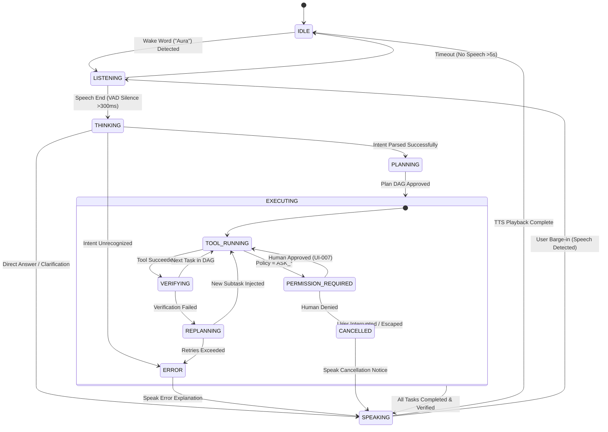

# AURA OS — Canonical UI Component & Interaction Registry
> **Autonomous Unified Runtime Architecture**
> Version: 0.1.0-draft | Status: Canonical Specification | Target: Wayland Layer-Shell (GTK4 / Rust)

---

## 1. Design Philosophy

The AURA user interface is built upon a fundamental departure from legacy graphical desktop paradigms:

1. **Voice-First, Multi-Modal Fallback**: Speech is the primary interaction medium; visual components exist to provide high-bandwidth observability, ambient reassurance, and interactive confirmation for critical actions.
2. **Ambient & Non-Intrusive**: The interface is quiet and unobtrusive by default. It does not look like a perpetual chatbot window pinned to the screen. It emerges gracefully when intent is detected and melts away once verification is complete.
3. **Context-Aware Presence**: Surfaces adapt dynamically based on what the user is doing—displaying code diffs when programming, document summaries when reading, and file graphs when organizing.
4. **Native Wayland Performance**: Implemented natively in **Rust** using **GTK4** and `gtk4-layer-shell` for buttery 60fps animations, sub-16ms render times, and minimal memory footprint (<50MB RSS).
5. **Futuristic Yet Utilitarian**: Incorporates subtle frosted glassmorphism, luminous state indicators, and fluid physics curves without sacrificing clarity, accessibility, or keyboard efficiency.

---

## 2. Visual Design System & Design Tokens

### 2.1 Color Tokens & Semantic States

AURA uses a curated, dark-neutral color palette with illuminated semantic accents:

```
Foundation Dark:       #0A0D14 (Deep Void Canvas)
Surface Elev-1:        #121620 (Translucent Layer, 80% opacity)
Surface Elev-2:        #1A202E (Card Background, 85% opacity)
Surface Border:        #263045 (Subtle 1px glass rim illumination)
Text Primary:          #F0F4FC (High contrast off-white)
Text Secondary:        #8E9AB0 (Muted slate)
Text Disabled:         #4B5568 (Subtle outline)
```

#### State Color Mapping
| State | Accent Hex | Visual Appearance | Voice / Audio Meaning |
| :--- | :---: | :--- | :--- |
| **IDLE** | `#64748B` | Subtle slate breathing luminescence | Ambient quiet, waiting for wake word |
| **LISTENING** | `#06B6D4` | Electric Cyan expanding waveform | Actively capturing and buffering microphone speech |
| **THINKING** | `#8B5CF6` | Deep Purple rotating internal shimmer | Decomposing goal, routing model, generating plan |
| **EXECUTING** | `#10B981` | Emerald Green pulsating progress rings | Running sandboxed tools, compiling, moving files |
| **SPEAKING** | `#3B82F6` | Sapphire Blue undulating speech waves | Neural TTS streaming audio out through speakers |
| **PERMISSION**| `#F59E0B` | Amber Warning focal glow | Blocked: Awaiting human interactive confirmation |
| **ERROR / FAIL**| `#EF4444`| Crimson Pulse with sharp decay | Execution failure, verification rejected, or exception |

### 2.2 Typography
- **UI & Display**: `Inter` (Variable font: 300 Light, 400 Regular, 500 Medium, 600 Semi-Bold, 700 Bold).
- **Code & Terminals**: `JetBrains Mono` (400 Regular, 600 Bold) with ligatures enabled.
- **Scale**:
  - `Hero Display`: 32px / line-height 40px (Voice Overlay heading)
  - `Title`: 20px / line-height 28px (Modal headings, Agent cards)
  - `Body`: 14px / line-height 20px (Standard text, transcripts)
  - `Caption / Meta`: 11px / line-height 16px (Token metrics, timestamps)
  - `Mono / Code`: 13px / line-height 18px (Diffs, command outputs)

### 2.3 Geometry & Elevation
- **Corner Radii**:
  - Micro (`4px`): Badges, tooltips, checkboxes
  - Component (`8px`): Buttons, input fields, code blocks
  - Card / Panel (`16px`): Agent cards, notifications, monitor panels
  - Modal / Overlay (`24px`): Voice overlay, permission dialogs
  - Orb (`Pill / Full Circle`): 50% border radius
- **Blur & Glassmorphism**:
  - Ambient surfaces use `backdrop-filter: blur(20px)` with 85% alpha background fill.
  - Border rim: `1px solid rgba(255, 255, 255, 0.08)`.

### 2.4 Motion & Physics
- **Durations**:
  - Micro-interactions (hover, active): `120ms`
  - Expansion / Slide-in: `220ms`
  - State transitions: `300ms`
- **Curves**:
  - Standard ease: `cubic-bezier(0.16, 1, 0.3, 1)` (snappy ease-out)
  - Spring pulse: Mass 1.0, Stiffness 140, Damping 12.

---

## 3. Voice Interaction State Machine

The interaction between speech, visualization, and system state follows a deterministic finite state machine:



---

## 4. Canonical UI Component Registry

---

### `UI-001` — Aura Orb
- **Name**: Ambient Aura Orb
- **Purpose**: The primary persistent visual indicator of AURA's presence, listening state, and thinking activity.
- **Status**: 🔵 Planned
- **Priority**: P0
- **Location**: Top-right status bar or floating ambient widget (user configurable).
- **Trigger**: Persistent on desktop; state changes triggered by D-Bus signals from `org.auraos.Voice`.
- **Inputs**: `VoiceState` (`IDLE`, `LISTENING`, `THINKING`, `EXECUTING`, `SPEAKING`, `ERROR`, `PERMISSION`).
- **States**:
  - `Idle`: 32px diameter, Slate (#64748B), slow 4-second breathing glow.
  - `Listening`: Expands to 48px, Electric Cyan (#06B6D4), reactive acoustic ripple.
  - `Thinking`: Deep Purple (#8B5CF6), fluid 360-degree internal shader rotation.
  - `Executing`: Emerald Green (#10B981), rhythmic harmonic pulse.
  - `Speaking`: Sapphire Blue (#3B82F6), undulating vertical waveform bars.
  - `Permission`: Amber Warning (#F59E0B), high-contrast rapid flash.
  - `Error`: Crimson (#EF4444), abrupt double-pulse and fade.
- **Interactions**:
  - `Single Click`: Manually toggle listening state (push-to-talk equivalent).
  - `Right Click`: Open context menu (Agent Monitor, Settings, Mute).
  - `Double Click`: Open `UI-004` (Agent Monitor).
- **Keyboard Behavior**: `Super + Space` focuses and triggers Orb listening.
- **Voice Behavior**: Wake word "Aura" transitions Orb to `LISTENING`.
- **Accessibility**: Tooltip reports textual state; screen-reader accessible via AT-SPI.
- **Dependencies**: Wayland layer-shell, GTK4.
- **Implementation File**: `desktop/components/orb.rs`
- **Notes**: Must maintain zero frame drops during heavy CPU loads.

---

### `UI-002` — Voice Overlay
- **Name**: Heads-Up Voice Overlay
- **Purpose**: Displays the active transcription and real-time reasoning feedback during voice interaction.
- **Status**: 🔵 Planned
- **Priority**: P0
- **Location**: Screen center-top or bottom-center (user preference).
- **Trigger**: Transition to `LISTENING` state.
- **Inputs**: Streaming audio PCM data (for waveform), partial STT tokens.
- **States**:
  - `Hidden`: Opacity 0, translateY(-20px).
  - `Listening`: Slides down, displays live oscilloscope waveform and partial text.
  - `Thinking`: Waveform transitions to shimmer line; displays parsed goal.
- **Interactions**: Click outside or press `Escape` to dismiss and cancel.
- **Keyboard Behavior**: `Escape` cancels; `Enter` forces immediate submission.
- **Voice Behavior**: Fades out automatically 1.5 seconds after speaking completes.
- **Accessibility**: High contrast text, scalable typography up to 200%.
- **Dependencies**: `UI-001`, `UI-003`.
- **Implementation File**: `desktop/components/voice_overlay.rs`
- **Notes**: Must not obscure active window focal areas unnecessarily.

---

### `UI-003` — Command Transcript
- **Name**: Live Command Transcript
- **Purpose**: Renders real-time word-by-word transcription as speech is processed by `faster-whisper`.
- **Status**: 🔵 Planned
- **Priority**: P1
- **Location**: Embedded within `UI-002` (Voice Overlay).
- **Trigger**: Streaming token emission over D-Bus signal `org.auraos.Voice.TranscriptUpdated`.
- **Inputs**: UTF-8 string token chunks, confidence scores.
- **States**: `Streaming` (gray text), `Finalized` (white text with subtle underline).
- **Interactions**: Double-click allows manual keyboard text editing before execution.
- **Keyboard Behavior**: Arrow keys allow inline cursor navigation.
- **Voice Behavior**: Updates continuously with <50ms lag behind spoken words.
- **Accessibility**: Screen-reader announces finalized sentences.
- **Dependencies**: `UI-002`.
- **Implementation File**: `desktop/components/transcript.rs`
- **Notes**: Low-confidence words are styled with a subtle dotted underline.

---

### `UI-004` — Agent Monitor
- **Name**: Autonomous Agent Monitor
- **Purpose**: System-wide dashboard providing transparent observability into all active, queued, and completed agent tasks.
- **Status**: 🔵 Planned
- **Priority**: P1
- **Location**: Floating Wayland overlay window or dedicated workspace.
- **Trigger**: `Super + A`, double-clicking `UI-001`, or voice command *"Aura, show agents"*.
- **Inputs**: D-Bus stream from `org.auraos.AgentManager`.
- **States**: `Empty` (no active tasks), `Active` (displaying running agent cards), `History` (past runs).
- **Interactions**: Filter by agent status, pause task, kill runaway task, inspect logs.
- **Keyboard Behavior**: `Tab` cycles agent cards; `K` terminates selected agent.
- **Voice Behavior**: *"Aura, kill task 2"* triggers immediate agent cancellation.
- **Accessibility**: Fully navigable via keyboard; aria-live announcements for task finishes.
- **Dependencies**: `UI-005`, `UI-006`.
- **Implementation File**: `desktop/components/agent_monitor.rs`
- **Notes**: Essential for fulfilling the "Mandatory Observability" design principle.

---

### `UI-005` — Agent Card
- **Name**: Agent Status Card
- **Purpose**: Displays the real-time execution metrics of an individual agent process.
- **Status**: 🔵 Planned
- **Priority**: P1
- **Location**: Child component of `UI-004`.
- **Trigger**: Agent instantiation.
- **Inputs**: Agent ID, Name, Goal, State, Token Consumption, Cost ($), Active Step.
- **States**: `Running`, `Waiting Permission`, `Completed`, `Failed`.
- **Interactions**: Click to expand step log; click red X to terminate.
- **Keyboard Behavior**: `Enter` expands detailed execution timeline.
- **Voice Behavior**: Direct reference via voice (e.g. *"Show details for the coder agent"*).
- **Accessibility**: Announces percentage completion to screen readers.
- **Dependencies**: GTK4 Box / ListBox.
- **Implementation File**: `desktop/components/agent_card.rs`
- **Notes**: Includes an animated progress ring matching the agent's current task state.

---

### `UI-006` — Task Graph
- **Name**: Interactive Task DAG Visualizer
- **Purpose**: Visualizes the dependency graph of decomposed sub-tasks for multi-step goals.
- **Status**: 🔵 Planned
- **Priority**: P2
- **Location**: Expandable pane within `UI-004` or standalone inspector.
- **Trigger**: Clicking "View Graph" on an active multi-step task.
- **Inputs**: JSON DAG specification containing nodes and directional edges.
- **States**: Nodes color-coded: Gray (Pending), Blue (Running), Green (Passed), Red (Failed).
- **Interactions**: Pan and zoom; click node to inspect tool arguments and output diffs.
- **Keyboard Behavior**: Arrow keys navigate nodes; `Space` toggles node inspector.
- **Voice Behavior**: *"Aura, why is task 3 blocked?"* opens graph and highlights dependency.
- **Accessibility**: Fallback hierarchical text tree view available.
- **Dependencies**: Cairo / GTK4 drawing canvas.
- **Implementation File**: `desktop/components/task_graph.rs`
- **Notes**: Critical for complex coding and refactoring workflows.

---

### `UI-007` — Permission Dialog
- **Name**: Interactive Permission Elevation Modal
- **Purpose**: The mandatory physical barrier for authorizing consequential, sensitive, or destructive actions.
- **Status**: 🔵 Planned
- **Priority**: P0
- **Location**: Screen center modal with darkened backdrop scrim.
- **Trigger**: Agent triggers a tool with policy `ASK_ONCE` or `ASK_ALWAYS`, or any destructive action.
- **Inputs**: `PermissionRequest` (Agent Name, Tool, Parameters, Risk Level, Unified Diff/Preview).
- **States**: `Awaiting User Input`, `Timed Out (Auto-Deny after 60s)`.
- **Interactions**:
  - `Allow Once` (Button)
  - `Allow for Task` (Button)
  - `Deny` (Button / Escape)
  - `Inspect Diff` (Collapsible view)
- **Keyboard Behavior**: `Enter` selects Allow (requires explicit tab or `Y` key); `Escape` selects Deny.
- **Voice Behavior**: **VOICE CANNOT AUTHORIZE**. Voice saying "Approve" is ignored with prompt: *"Please click or press Enter to confirm."*
- **Accessibility**: Modal traps focus; high contrast danger borders for `CRITICAL` risk level.
- **Dependencies**: `desktop/shell`, Wayland layer-shell modal.
- **Implementation File**: `desktop/components/permission_dialog.rs`
- **Notes**: Core pillar of the AURA security architecture.

---

### `UI-008` — Semantic Search Omnibar
- **Name**: Semantic Omnibar & File Search
- **Purpose**: Natural-language search overlay querying local document embeddings, files, and past tasks.
- **Status**: 🔵 Planned
- **Priority**: P2
- **Location**: Top-center floating bar.
- **Trigger**: `Super + F` or voice command *"Aura, search for..."*.
- **Inputs**: Query string, vector similarity results from `sqlite-vec`.
- **States**: `Typing`, `Searching (spinner)`, `Results List`.
- **Interactions**: Arrow navigation, click to open file in default app.
- **Keyboard Behavior**: `Up`/`Down` arrows to navigate; `Enter` to open; `Escape` to close.
- **Voice Behavior**: Dictates search query directly.
- **Accessibility**: Semantic listbox with aria role announcements.
- **Dependencies**: `UI-009`, `MEM-002`.
- **Implementation File**: `desktop/components/search_omnibar.rs`
- **Notes**: Queries both metadata and content chunks.

---

### `UI-009` — File Result Card
- **Name**: Semantic File Result Card
- **Purpose**: Displays individual search hits with context snippets and similarity scores.
- **Status**: 🔵 Planned
- **Priority**: P2
- **Location**: Item inside `UI-008`.
- **Trigger**: Search query completion.
- **Inputs**: File path, MIME icon, matched snippet text, similarity percentage.
- **States**: `Normal`, `Hovered`, `Selected`.
- **Interactions**: Click opens file; right click shows folder location.
- **Keyboard Behavior**: `Space` previews in quick-look popup.
- **Voice Behavior**: *"Aura, open the second result"* triggers item activation.
- **Accessibility**: Speaks file name and match preview.
- **Dependencies**: `UI-008`.
- **Implementation File**: `desktop/components/file_result.rs`
- **Notes**: Highlights matching semantic keywords in yellow.

---

### `UI-010` — Notification Toast
- **Name**: Ambient Notification Toast
- **Purpose**: Transient status updates and alerts that do not require full modal interruption.
- **Status**: 🔵 Planned
- **Priority**: P1
- **Location**: Top-right corner below status bar.
- **Trigger**: Task completion, background warning, external message.
- **Inputs**: Title, Body text, Icon, Expiration duration (default 4s).
- **States**: `Slide In`, `Visible`, `Fade Out`.
- **Interactions**: Click to focus originating agent; swipe right to dismiss.
- **Keyboard Behavior**: `Super + N` focuses newest notification.
- **Voice Behavior**: High-priority notifications are also spoken aloud by Aura.
- **Accessibility**: Emits standard desktop notification events over D-Bus.
- **Dependencies**: Wayland layer-shell.
- **Implementation File**: `desktop/components/notification.rs`
- **Notes**: Auto-dismiss pauses when cursor hovers over toast.

---

### `UI-011` — Context Inspector
- **Name**: Grounding & Context Inspector
- **Purpose**: Developer tool displaying what AURA currently perceives (active window, clipboard, terminal buffer).
- **Status**: 🔵 Planned
- **Priority**: P2
- **Location**: Floating developer HUD.
- **Trigger**: `Super + Shift + C` or *"Aura, show your context"*.
- **Inputs**: Active window title, process name, clipboard preview, terminal scrollback.
- **States**: Real-time live update stream.
- **Interactions**: Copy context JSON, force refresh, clear privacy buffer.
- **Keyboard Behavior**: `Escape` closes inspector.
- **Voice Behavior**: Can query specific context items verbally.
- **Accessibility**: Structured key-value table.
- **Dependencies**: `CTX-001` through `CTX-004`.
- **Implementation File**: `desktop/components/context_inspector.rs`
- **Notes**: Invaluable for debugging "Aura, fix this" intent parsing.

---

### `UI-012` — Memory Viewer
- **Name**: Unified Memory & Knowledge Browser
- **Purpose**: Graphical browser allowing users to inspect, search, and prune episodic and semantic memories.
- **Status**: 🔵 Planned
- **Priority**: P2
- **Location**: Dedicated window (`DESKTOP-003`).
- **Trigger**: Launched via Settings or command *"Aura, open memory"*.
- **Inputs**: SQLite database records from `aura.db` and `vectors.db`.
- **States**: `Timeline View`, `Vector Clusters View`, `Entity Relationship View`.
- **Interactions**: Delete individual memories, edit user preferences, export knowledge archive.
- **Keyboard Behavior**: Standard list search and navigation shortcuts.
- **Voice Behavior**: *"Aura, forget what I said about..."* deletes memory with visual update.
- **Accessibility**: Fully accessible tabular view.
- **Dependencies**: `MEM-001`, `MEM-002`.
- **Implementation File**: `desktop/components/memory_viewer.rs`
- **Notes**: Crucial for user data sovereignty and GDPR compliance (Right to be Forgotten).

---

### `UI-013` — Skill Manager
- **Name**: Tool & Skill Registry Dashboard
- **Purpose**: View installed system skills, registered MCP servers, and configure execution permissions.
- **Status**: 🔵 Planned
- **Priority**: P2
- **Location**: Dedicated window (`DESKTOP-004`).
- **Trigger**: Settings menu or voice *"Aura, show skills"*.
- **Inputs**: List of registered tools from `ToolRegistry`.
- **States**: `Installed`, `Available`, `Configuring`.
- **Interactions**: Toggle default policy (`ALLOW` vs `ASK_ALWAYS`), add MCP server endpoints.
- **Keyboard Behavior**: Standard settings navigation.
- **Voice Behavior**: Queries installed tools.
- **Accessibility**: Accessible form controls.
- **Dependencies**: `TOOL-003`, `TOOL-004`.
- **Implementation File**: `desktop/components/skill_manager.rs`
- **Notes**: Displays manifest schema and documentation for each tool.

---

### `UI-014` — Model Manager
- **Name**: Model Router & LLM Console
- **Purpose**: Configure local quantized models, cloud API keys, latency/cost budgets, and fallback tiers.
- **Status**: 🔵 Planned
- **Priority**: P2
- **Location**: Dedicated window (`DESKTOP-005`).
- **Trigger**: Settings menu or command *"Aura, open model settings"*.
- **Inputs**: Config file `~/.config/aura/config.toml`.
- **States**: `Local Model Active`, `Cloud Fallback Enabled`, `Offline Forced`.
- **Interactions**: Download new GGUF models, test inference latency, enter API tokens.
- **Keyboard Behavior**: Form navigation.
- **Voice Behavior**: *"Aura, switch to local models only"* toggles offline mode.
- **Accessibility**: Secure password input fields for API keys.
- **Dependencies**: `aura/models`.
- **Implementation File**: `desktop/components/model_manager.rs`
- **Notes**: Displays live token/sec benchmarks and monthly API expenditure.

---

### `UI-015` — System Settings Panel
- **Name**: AURA System Settings
- **Purpose**: Global control center for voice sensitivities, audio devices, displays, and security policies.
- **Status**: 🔵 Planned
- **Priority**: P2
- **Location**: Standalone window (`DESKTOP-006`).
- **Trigger**: `Super + I` or standard system menu.
- **Inputs**: User configuration file.
- **States**: Tabbed categories (Voice, Intelligence, Security, Appearance).
- **Interactions**: Sliders for VAD threshold, wake-word sensitivity, theme selectors.
- **Keyboard Behavior**: `Ctrl + Tab` switches categories.
- **Voice Behavior**: *"Aura, open settings"* launches panel.
- **Accessibility**: Standard GTK4 accessibility tree.
- **Dependencies**: GTK4 Adwaita widgets.
- **Implementation File**: `desktop/components/settings.rs`
- **Notes**: Persists changes immediately to disk.

---

### `UI-016` — System Monitor
- **Name**: Kernel & CGroup Resource Monitor
- **Purpose**: Visualizes CPU, memory, GPU, and sandbox cgroup resource consumption in real-time.
- **Status**: 🔵 Planned
- **Priority**: P2
- **Location**: Slide-out tray or floating utility.
- **Trigger**: System status button or voice *"Aura, what's my CPU usage?"*.
- **Inputs**: `/proc/stat`, `/proc/meminfo`, systemd cgroup metrics.
- **States**: Live rolling graphs (60s history).
- **Interactions**: Click process/agent to inspect resource limits.
- **Keyboard Behavior**: Standard process manager hotkeys (`F9` to terminate).
- **Voice Behavior**: Answers queries on system load directly.
- **Accessibility**: Tabular numbers with screen-reader descriptions.
- **Dependencies**: `systemd`, `cgroups v2`.
- **Implementation File**: `desktop/components/system_monitor.rs`
- **Notes**: Separates user application usage from AURA agent daemon consumption.

---

### `UI-017` — AI-Assisted Terminal Overlay
- **Name**: Integrated AURA Terminal
- **Purpose**: A native VTE terminal emulator with direct ambient agent copilot integration.
- **Status**: 🔵 Planned
- **Priority**: P2
- **Location**: Dropdown terminal (`F12` hotkey) or tiled window.
- **Trigger**: `F12` or voice command *"Aura, open terminal"*.
- **Inputs**: PTY input/output, shell integration streams.
- **States**: `Interactive Shell`, `Agent Autonomous Execution Mode`.
- **Interactions**: Standard command entry; agent command approval overlays.
- **Keyboard Behavior**: Standard POSIX terminal shortcuts.
- **Voice Behavior**: Direct speech-to-command insertion.
- **Accessibility**: High contrast terminal color schemes.
- **Dependencies**: `vte4` / GTK4.
- **Implementation File**: `desktop/components/terminal.rs`
- **Notes**: Displays subtle inline annotations when an agent is analyzing errors.

---

### `UI-018` — Agent Timeline
- **Name**: Chronological Execution Timeline
- **Purpose**: Step-by-step visual audit trail of a completed or ongoing agent run.
- **Status**: 🔵 Planned
- **Priority**: P2
- **Location**: Detail view inside `UI-004` (Agent Monitor).
- **Trigger**: Clicking an agent card in the monitor.
- **Inputs**: Array of timestamped events (Plan, ToolCall, Output, Verification).
- **States**: Expandable accordion list of execution steps.
- **Interactions**: Click step to expand stdin/stdout and file diffs.
- **Keyboard Behavior**: Arrow keys navigate steps.
- **Voice Behavior**: *"Aura, what was step 2?"* reads back specific step.
- **Accessibility**: Accessible tree structure.
- **Dependencies**: `UI-004`.
- **Implementation File**: `desktop/components/agent_timeline.rs`
- **Notes**: Exports full trace to markdown or JSON for debugging.

---

### `UI-019` — Error & Recovery HUD
- **Name**: Autonomous Failure Recovery Dialog
- **Purpose**: Informs the user when an autonomous plan has exhausted retries and requests human guidance.
- **Status**: 🔵 Planned
- **Priority**: P1
- **Location**: Centered overlay modal.
- **Trigger**: Agent transitions to `FAILED` or triggers `REPLANNING_EXHAUSTED`.
- **Inputs**: Failing task details, compiler/tool error message, suggested recovery options.
- **States**: `Active Warning`.
- **Interactions**:
  - `Retry with New Prompt` (Voice or text entry)
  - `Edit Code Manually` (Opens editor at failing line)
  - `Abort Task` (Cleans up sandbox)
- **Keyboard Behavior**: `R` to retry, `A` to abort.
- **Voice Behavior**: Speaks failure reason and asks: *"How would you like to proceed?"*.
- **Accessibility**: High contrast warning icons; audible alert chime.
- **Dependencies**: `UI-007`.
- **Implementation File**: `desktop/components/recovery_hud.rs`
- **Notes**: Prevents agents from silently failing in the background.

---

### `UI-020` — First Boot Experience (OOBE)
- **Name**: Out-of-the-Box Setup Wizard
- **Purpose**: Guides new users through audio calibration, wake-word training, and initial model downloads.
- **Status**: 🔵 Planned
- **Priority**: P2
- **Location**: Fullscreen modal on initial OS boot.
- **Trigger**: Absence of `~/.config/aura/setup_complete`.
- **Inputs**: Microphone hardware list, model download progress.
- **States**:
  - Step 1: Welcome & Vision Introduction
  - Step 2: Microphone & Speaker Test
  - Step 3: Wake-Word Voice Calibration ("Say: Aura")
  - Step 4: Model Configuration (Local vs Cloud API)
  - Step 5: Ready to Launch
- **Interactions**: Next / Back buttons; interactive voice testing.
- **Keyboard Behavior**: Full wizard navigation with `Enter` and `Tab`.
- **Voice Behavior**: Conversational onboarding guided by Piper TTS.
- **Accessibility**: Caption subtitles displayed for all spoken wizard prompts.
- **Dependencies**: `UI-001`, `UI-015`.
- **Implementation File**: `desktop/components/oobe.rs`
- **Notes**: Must be smooth, welcoming, and complete in under 3 minutes.

---

## 5. Screen Registry

| Screen ID | Name | Role | Primary Components | Trigger |
| :--- | :--- | :--- | :--- | :--- |
| **`DESKTOP-001`** | Ambient Wayland Desktop | Default system shell | `UI-001` Orb, `UI-002` Overlay, `UI-010` Toasts | System startup |
| **`DESKTOP-002`** | Agent Monitor Screen | Full agent observability | `UI-004` Monitor, `UI-005` Cards, `UI-006` Graph | `Super + A` / Voice |
| **`DESKTOP-003`** | Memory & Knowledge Browser | Inspect episodic/semantic stores| `UI-012` Memory Viewer, Table, Search | App Menu / Voice |
| **`DESKTOP-004`** | Skills & Tools Registry | Tool configuration & MCP | `UI-013` Skill Manager, Permissions | App Menu / Voice |
| **`DESKTOP-005`** | Model & Router Console | Model management & latency | `UI-014` Model Manager, Benchmarks | Settings / Voice |
| **`DESKTOP-006`** | System Settings & Privacy | Global hardware/security setup | `UI-015` Settings Panel | `Super + I` / Voice |

---

## 6. Voice Interaction Registry

Detailed specifications for the multi-sensory feedback (visual and auditory) emitted across voice interaction states:

| Voice State ID | State | What the User Sees | What the User Hears | Barge-in Behavior |
| :--- | :--- | :--- | :--- | :--- |
| **`VOICEUI-001`** | **Listening** | Orb turns Electric Cyan (`#06B6D4`) and expands; Voice Overlay appears with dynamic oscilloscope waveform. | Subtle pleasant high-register chime (15ms); microphone opens. | N/A (Already listening) |
| **`VOICEUI-002`** | **Thinking** | Orb transitions to Deep Purple (`#8B5CF6`) with a fluid 360° rotating shimmer; text transcript freezes and shows parsed intent. | Near-silent ambient micro-frequency hum indicating active inference. | User speech aborts current plan and restarts listening. |
| **`VOICEUI-003`** | **Executing** | Orb pulses Emerald Green (`#10B981`); an Agent Card slides into the corner showing task progress and tool names. | Silent, or brief tactile clicking sound when tools execute. | User speech pauses execution and opens voice overlay. |
| **`VOICEUI-004`** | **Speaking** | Orb undulates Sapphire Blue (`#3B82F6`) in sync with voice cadence; captions stream below overlay. | High-quality neural speech from Piper TTS speaking the verified outcome. | **Instant Barge-in**: User speech immediately mutes TTS and enters `VOICEUI-001`. |
| **`VOICEUI-005`** | **Permission Request** | Orb flashes Amber (`#F59E0B`); screen dims; Permission Dialog (`UI-007`) takes focal center. | Aura speaks: *"Aura needs permission to modify auth_service.py. Please confirm."* | Speech alone cannot approve; requires physical click or Enter. |
| **`VOICEUI-006`** | **Failure / Recovery** | Orb double-pulses Crimson (`#EF4444`); Recovery HUD (`UI-019`) appears with error breakdown. | Aura speaks: *"The tests failed due to an unresolved import. Would you like me to inspect it?"* | User can answer verbally to authorize replanning. |
| **`VOICEUI-007`** | **Interrupted** | Orb snaps immediately to Cyan (`#06B6D4`); Voice Overlay clears previous transcript. | Instant cut-off of TTS audio (<20ms); soft reset chime. | Transitions immediately to `VOICEUI-001`. |

---

## 7. Cross-Document Navigation

- Public introduction & Vision: [README.md](file:///Users/aryansingh/Documents/Aura-OS/README.md)
- Complete technical architecture: [ARCHITECTURE.md](file:///Users/aryansingh/Documents/Aura-OS/ARCHITECTURE.md)
- Phased implementation plan: [PLAN.md](file:///Users/aryansingh/Documents/Aura-OS/PLAN.md)
- Live project state machine & Task registry: [PROGRESS-TRACKER.md](file:///Users/aryansingh/Documents/Aura-OS/PROGRESS-TRACKER.md)
